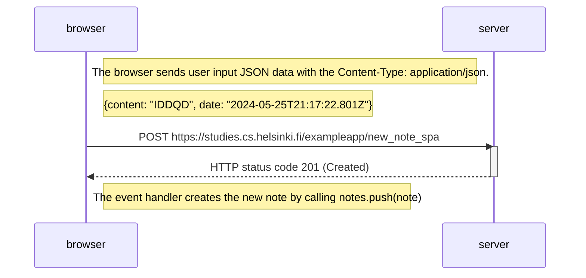

```mermaid
sequenceDiagram
    participant B as browser
    participant S as server

    Note right of B: The browser sends user input JSON data with the Content-Type: application/json.
    Note right of B: {content: "IDDQD", date: "2024-05-25T21:17:22.801Z"}

    B->>S: POST https://studies.cs.helsinki.fi/exampleapp/new_note_spa
    activate S
    S-->>B: HTTP status code 201 (Created)
    deactivate S

    Note right of B: The event handler creates the new note by calling notes.push(note)
```